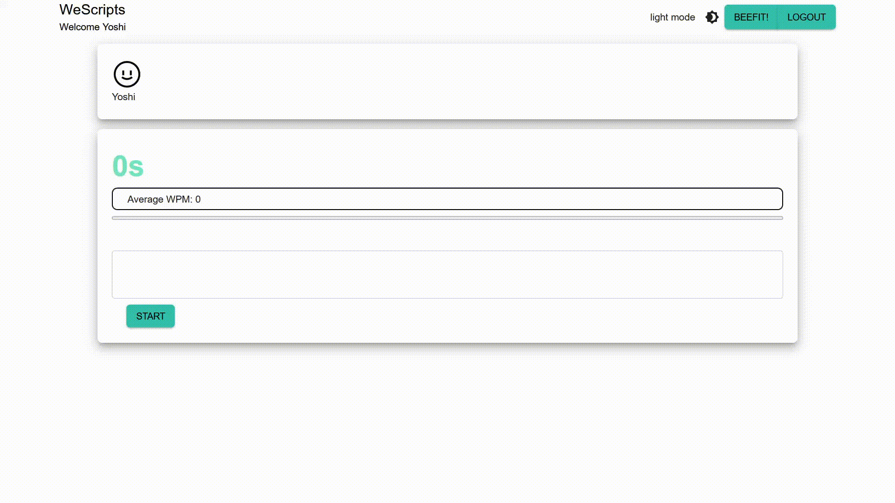
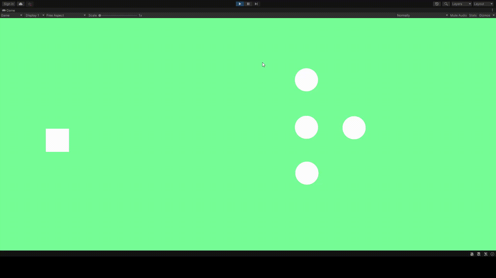

# Hello world, my name is Yeshua Lopez 👋
### I'm a fullstack developer!
I’m currently learning C#, C++, and game development using Unity!
I recently graduated an intensive coding bootcamp where I learned and collaborated with a group of hard working people.
- I'm open to collaborate on front-end, back-end, or even game development.
- 📫 You can reach me through my email! :D  @lopezyeshua@gmail.com
- Connect with me through [Linkedin](https://www.linkedin.com/in/yeshua-lopez-232306184/)!

 

<h1 class="webApps">Most Recent Web Applications</h1>

## [WeScripts](https://github.com/LopezYeshua/WeScripts)

 

<h1 class ="gameDev">Most Recent Game Demos</h1>

## [Top Down Shooter Demo](https://github.com/LopezYeshua/topDownShooter)

<!---
LopezYeshua/LopezYeshua is a ✨ special ✨ repository because its `README.md` (this file) appears on your GitHub profile.
You can click the Preview link to take a look at your changes.
--->
